# 🌍 GlobalNomad

**GlobalNomad**는  
판매자(호스트)와 체험자(게스트) 역할을 모두 수행할 수 있는 **체험 예약 플랫폼**입니다.  
호스트는 체험과 예약 일정을 관리하고, 사용자는 체험 탐색·예약·리뷰를 할 수 있습니다.

OAuth 인증과 외부 SDK 연동을 통해 실제 서비스 흐름을 고려한 기능을 구현했습니다.

## 📌 프로젝트 개요

- **프로젝트 기간**: 2025.12.18 ~ 2026.01.18 (약 1개월)
- **프로젝트 유형**: 프론트엔드 팀 프로젝트
- **참여 인원**: 4명
  - [양은지](https://github.com/eunji0124)
  - [이나래](https://github.com/jerryko570)
  - [이선영](https://github.com/sylee86)
  - [현유진](https://github.com/yujin-fe)

## 🚀 기술 스택

### Frontend


> TailwindCSS 유틸 관리:  
> `clsx`, `cva`, `tw-merge`, `cn` 활용

---

### Data & API


---

### Authentication


---

### Deployment


---

### Code Quality & Tooling


## 페이지별 기능

### 메인페이지

```
등록된 모든 체험의 조회가 가능하고, 검색, 필터링 기능을 제공합니다.
```

| Desktop                                    | Mobile                                     |
| ------------------------------------------ | ------------------------------------------ |
|  | 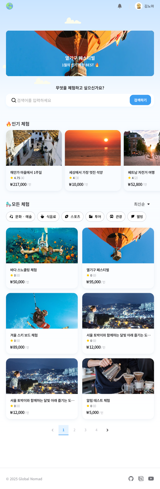 |

### 체험 상세 페이지

```
체험의 상세 정보를 확인할 수 있으며, 체험 관리자는 체험을 수정·삭제할 수 있습니다.

일반 사용자는 예약 가능한 날짜와 시간을 선택해 체험을 예약할 수 있습니다.

체험 주소는 Kakao Maps SDK를 연동하여 지도에서 확인할 수 있습니다.
```

| Desktop                                      | Mobile                                       |
| -------------------------------------------- | -------------------------------------------- |
| 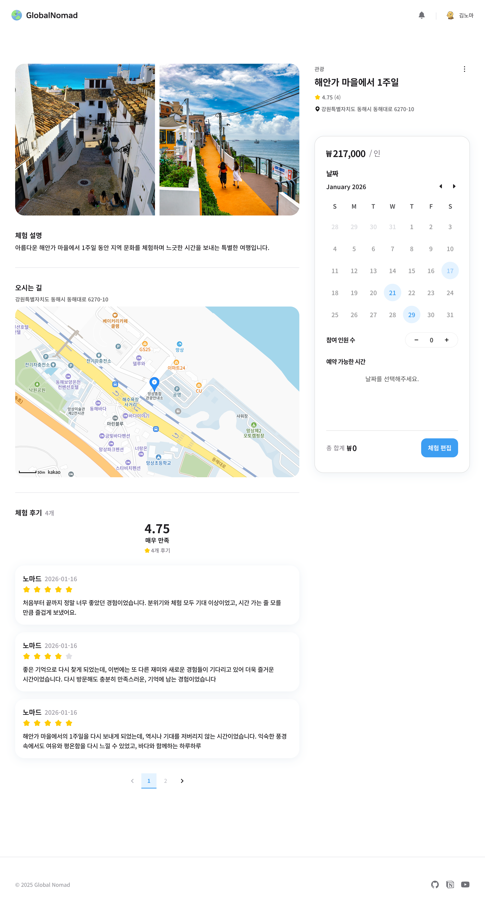 | 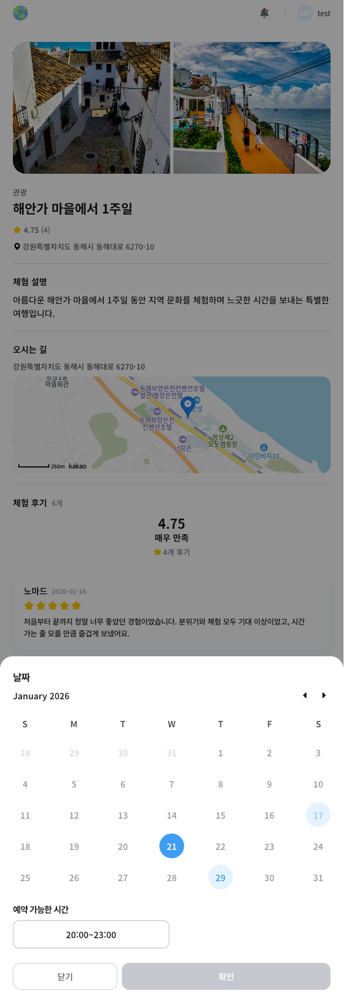 |

### 내 정보

```
프로필 이미지, 닉네임, 비밀번호 수정이 가능합니다.
```

| Desktop                                      | Mobile                                       |
| -------------------------------------------- | -------------------------------------------- |
| 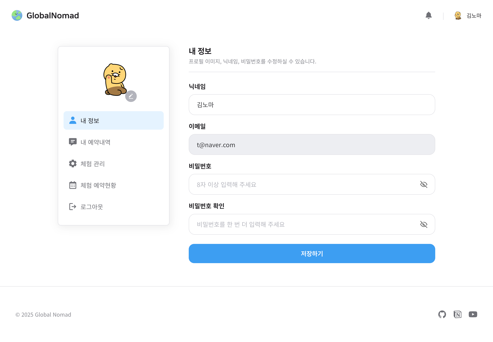 | 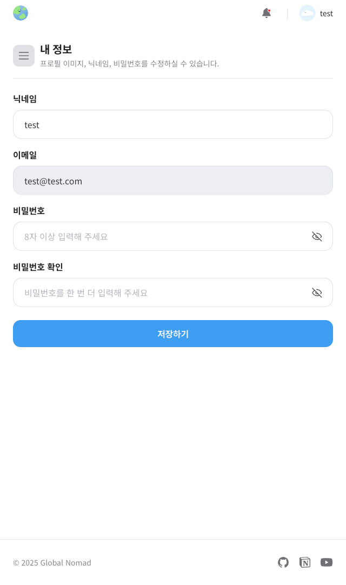 |

### 내 예약 내역

```
유저가 예약한 예약 내역을 리스트로 조회 가능하고, 예약 상태별 필터링이 가능합니다.
예약된 체험을 취소할 수 있습니다.
예약이 완료된 체험에는 후기를 남길 수 있습니다.
```

| Desktop                                             | Mobile                                              |
| --------------------------------------------------- | --------------------------------------------------- |
| 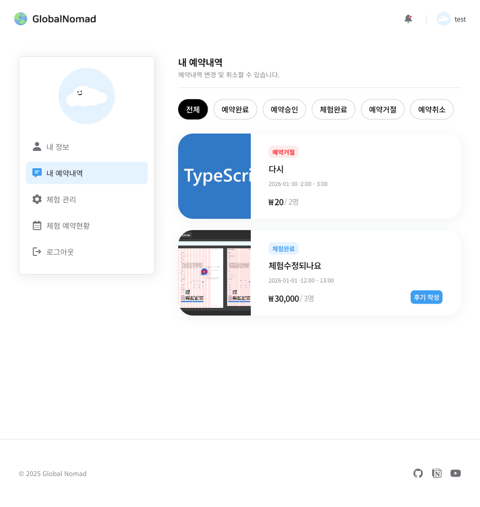 | 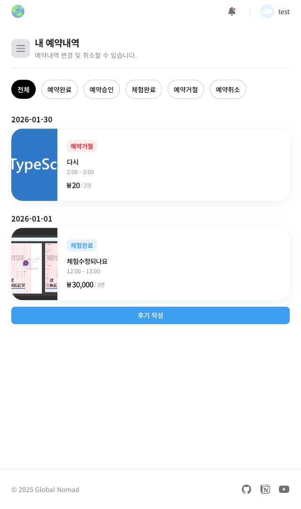 |

### 체험 관리

```
유저가 등록한 체험을 조회가능하며 체험 등록, 수정, 삭제가 가능합니다.
```

| Desktop                                            | Mobile                                             |
| -------------------------------------------------- | -------------------------------------------------- |
| 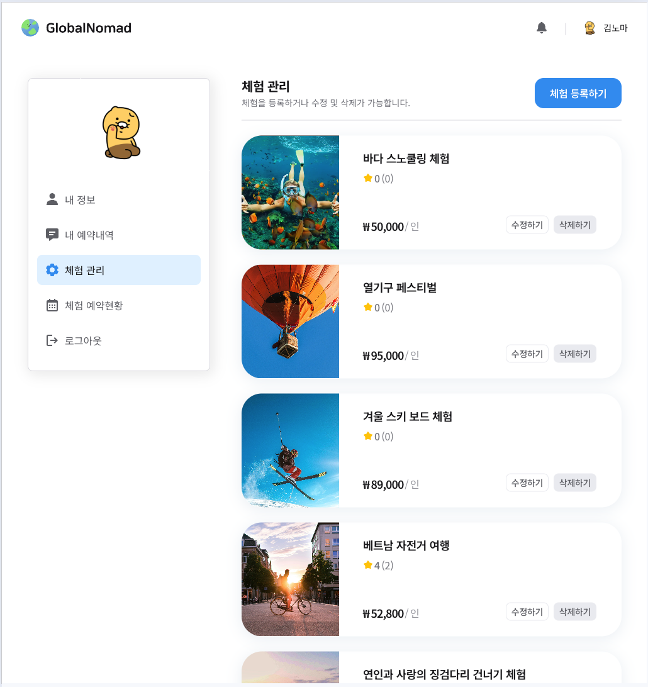 | 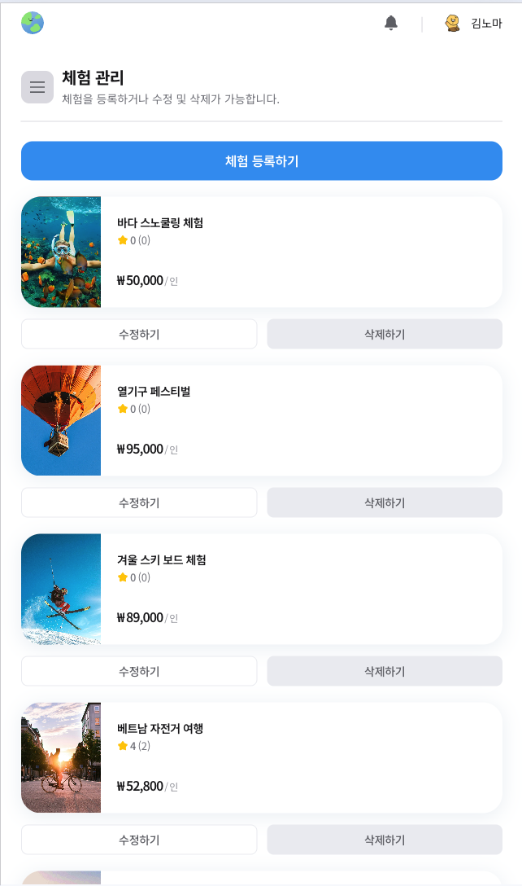 |

### 체험 예약 현황

```
등록한 체험에 대한 예약 현황을 체험별로 확인할 수 있으며, 신청된 예약을 승인, 거절 할 수 있습니다.
```

| Desktop                                                         | Mobile                                                          |
| --------------------------------------------------------------- | --------------------------------------------------------------- |
| 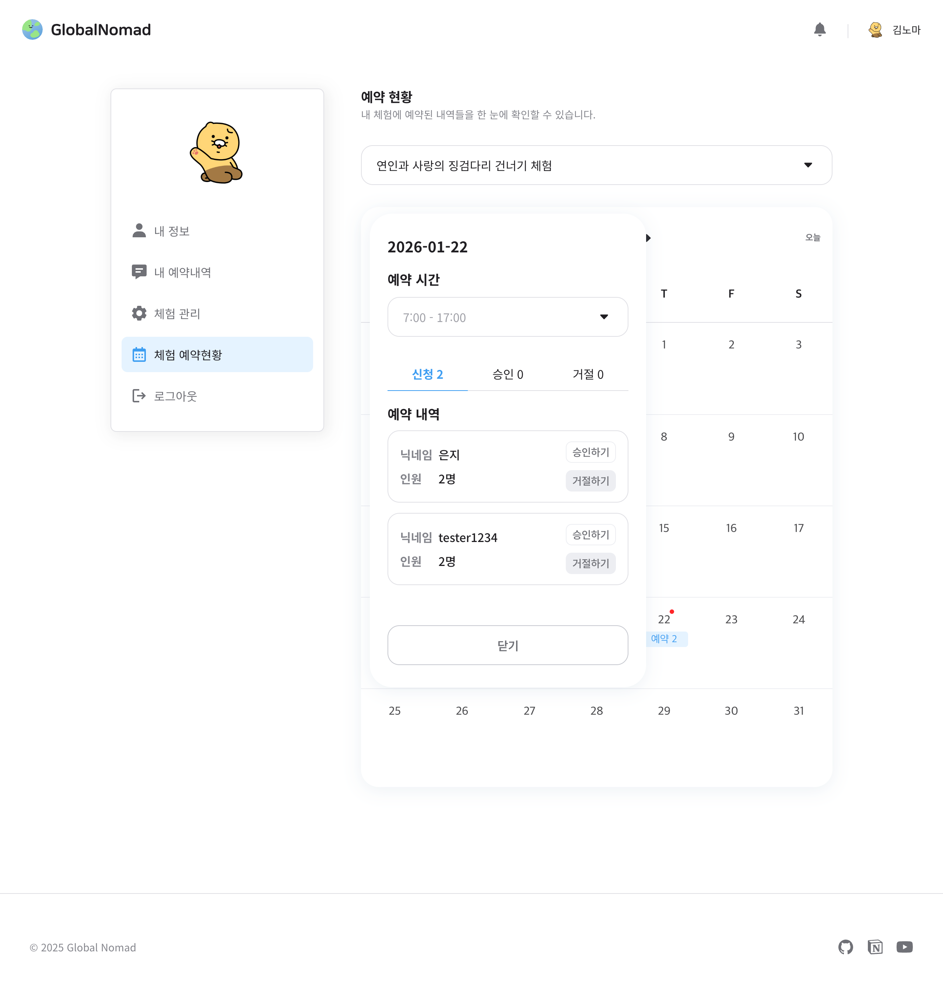 | 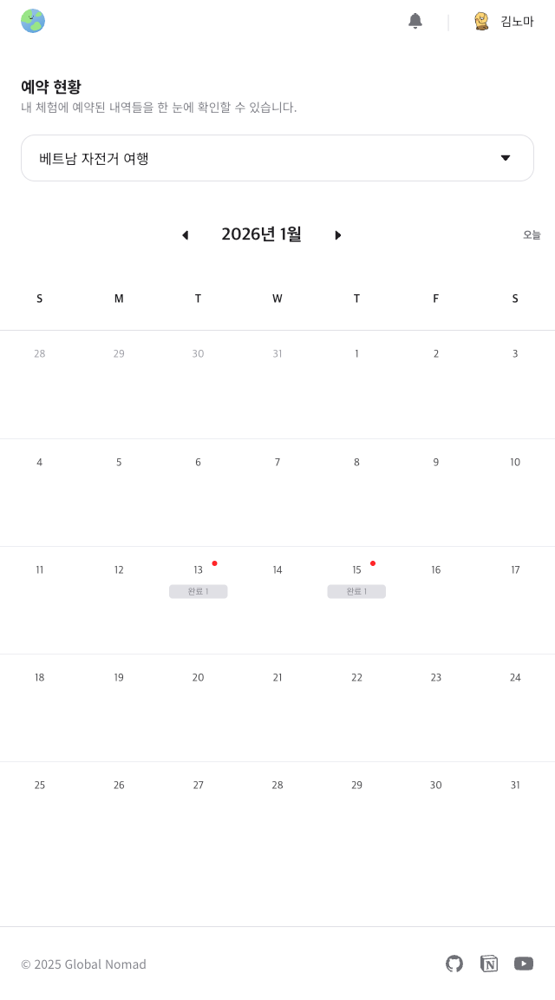 |
